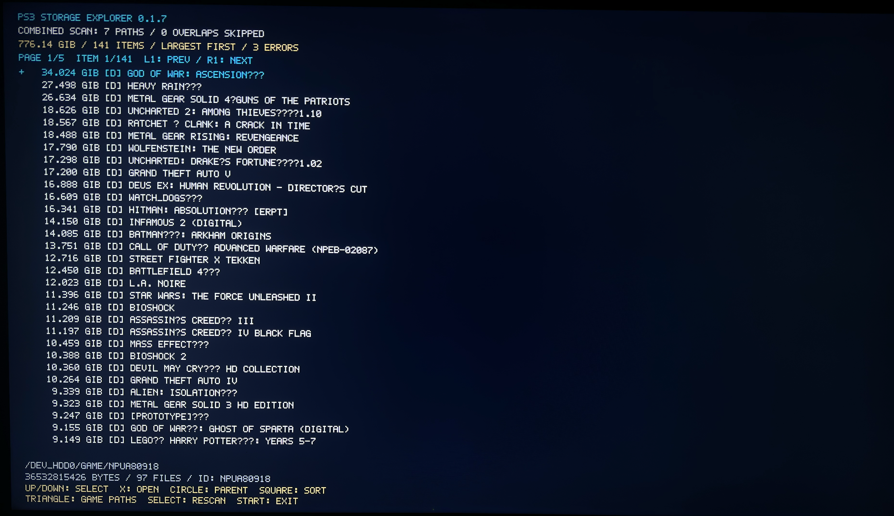

# PS3 Storage Explorer

[Slovenská verzia](README.sk.md)

Read-only homebrew storage browser for PlayStation 3 with an enabled homebrew environment (HEN or compatible CFW/Cobra). Measure individual games, installed data and other folders, and sort them by size.

**Current version: 0.1.7** · Title ID: `STOR00001`




## Installation

1. Download [PS3-Storage-Explorer-0.1.7.pkg](dist/PS3-Storage-Explorer-0.1.7.pkg).
2. Using your existing PS3 FTP server, upload it to `/dev_hdd0/packages/`.
3. In XMB, open **Game → Package Manager → Install Package Files**, select the internal/HDD package location and install it. Menu labels depend on your setup. Alternatively, use a PKG at the root of a PS3-readable FAT32 USB drive.
4. Enable HEN if your system requires it, then launch **PS3 Storage Explorer**.

The same Title ID updates the existing app. Scanning reads game files; there is no delete function. Installation writes the app itself. No PC build tools are required to install the supplied PKG.

[SHA256 checksum](dist/SHA256SUMS.txt) · [Console testing guide](docs/TESTING.md) · [Build instructions](docs/BUILDING.md)

## Features

- Recursive sizes using 64-bit counters; GiB in the list and exact bytes for the selected item.
- Largest/smallest first, paged results and directory navigation.
- Titles and IDs from `PARAM.SFO` or `PS3_GAME/PARAM.SFO` when available.
- Mark up to 32 paths across devices and sort their results together.
- Duplicate and nested selected roots are skipped to avoid scanning a subtree twice.
- Transparent XMB icon.

## Controls

Starts at **READY**. Select scans `/dev_hdd0/game`; Triangle opens the path menu.

| Button | Results | Path menu |
| --- | --- | --- |
| Up / Down | Select item | Select path |
| L1 / R1 | Previous / next page | Previous / next page |
| L2 / R2 | — | Previous / next available device |
| Square | Reverse size order | Mark / unmark path |
| X | Open directory | Scan marked paths, or highlighted path if none marked |
| Circle | Parent; combined results return to path menu | Close menu |
| Triangle | Open path menu | Close menu |
| R3 | — | Clear marks |
| Select | Repeat scan | Refresh available paths |
| Start | Return to XMB | Return to XMB |

Circle cancels a scan and retains partial results. Input is checked between filesystem operations; blocking I/O can delay cancellation or exit. Marks last for the current app session.

## Storage paths

Checks `/dev_hdd0`, detected `/dev_usb000`–`/dev_usb127`, and `/dev_sd`, `/dev_ms`, `/dev_cf`. Presets include:

- PS3: `game`, `GAMES`, `GAMEZ`, `PS3ISO`, `GAMEI`.
- PS1/PS2: `PSXISO`, `PSXGAMES`, `PS2ISO`, `PS2DISC`, `CD`, `DVD`, `ROMS/PSXISO`, `ROMS/PS2ISO`.
- Other: `PSPISO`, `ISO`, `ROMS`, `BDISO`, `DVDISO`, `video`, `packages`, `Packages`, `PKG`.
- Manager variants: `GAMES_DUP`, `GAMES_BAD`, `[auto]` variants, profiles `_1`–`_4`, legacy manager paths and device roots.

See [include/paths.h](include/paths.h) for the exact list. A preset means the directory can be measured, not that every format can be launched from that device.

Upload [paths.example.txt](dist/paths.example.txt) as `/dev_hdd0/game/STOR00001/USRDIR/paths.txt` for custom paths: up to 32 absolute local paths, one per line, without trailing slashes. Blank lines and `#` comments are ignored. Use UTF-8 without BOM; avoid `.` and `..` segments. Select in the path menu refreshes the list.

## Sizes and limitations

Sizes sum file lengths, not physically allocated disk space. **1 GiB = 1,073,741,824 bytes.** A backup in `GAMES` and installed data in `game` occupy separate space; they are not automatically merged into one game. Copies, hard links and mount aliases are not deduplicated.

ISO parts, BIN/CUE and covers appear separately unless grouped in a folder. Titles inside ISO images are not read. Limits: 8,192 result items, recursion depth 64, paths up to 1,023 bytes. ASCII font; unsupported characters appear as `?`. Errors, `[?]` and `CANCELLED` can indicate incomplete results.

No NTFS/exFAT-specific drivers or network/ps3netsrv scanning. Only paths available through the native filesystem are scanned.

## Validation

The user tested earlier version 0.1.2 on CECHL04, firmware 4.92, reported HEN/Cobra setup, 1080p: scanning, sizes, names and XMB return worked. This does not establish full 0.1.7 hardware compatibility. Later paging, path selection and icon changes were checked on PC; the supplied PKG was decrypted and its payload compared with build output.

Desktop tests cover sizes, large files, invalid metadata, sorting, cancellation, overlapping paths, paging and mocked display handling. They do not replace console testing.

Run with Python 3 and Zig, GCC or Clang:

```sh
python tests/run_tests.py
```

Put the compiler on PATH or set `ZIG_EXE` / `CC` to its executable path. `CC` does not accept embedded flags. SDKs, toolchain binaries and signing support data are not included; see [BUILDING.md](docs/BUILDING.md).

## Files

| Directory | Contents |
| --- | --- |
| `source`, `include` | Application code |
| `assets` | Transparent artwork and packaged `ICON0.PNG` |
| `dist` | Current PKG, checksum, build information and test fixture |
| `tools` | Build and icon scripts |
| `tests` | Desktop tests |
| `docs` | Build and console testing guides |

Replace `assets/ICON0.PNG` (320 × 176 PNG) and rebuild to change the icon. `tools/prepare_icon.ps1` generates it from the included transparent artwork.

References: [PSL1GHT](https://github.com/ps3dev/PSL1GHT), [PSDK3v2](https://github.com/Estwald/PSDK3v2), [webMAN MOD paths](https://github.com/aldostools/webMAN-MOD/wiki/Game-Paths-%26-Covers).
